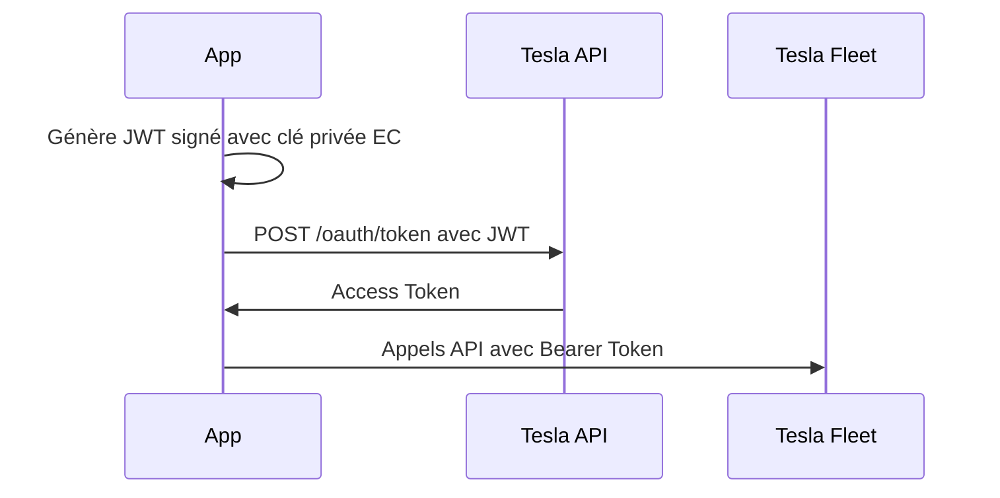
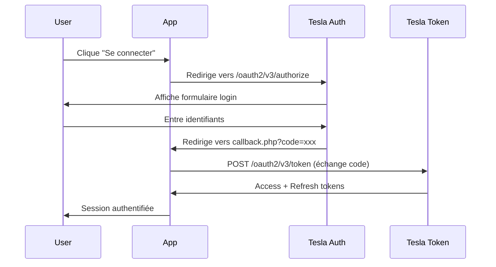

# 🔐 Flux OAuth Tesla - Guide Complet

Ce projet supporte **deux flux OAuth différents** pour s'authentifier auprès de l'API Tesla Fleet.

## 📊 Comparaison des Flux

| Aspect               | Partner Token (JWT)                         | User OAuth (Authorization Code)           |
| -------------------- | ------------------------------------------- | ----------------------------------------- |
| **Usage**            | Machine-to-machine                          | Authentification utilisateur              |
| **Authentification** | JWT signé ES256                             | Code d'autorisation + PKCE                |
| **Interaction**      | Aucune                                      | Redirection navigateur                    |
| **Token**            | Access token uniquement                     | Access + Refresh tokens                   |
| **Durée**            | 8 heures (28800s)                           | Configurable avec refresh                 |
| **Scopes**           | fleet_api:\*                                | vehicle_device_data, vehicle_cmds, etc.   |
| **Fichiers**         | `cli-get-token.php`, `public/get-token.php` | `public/login.php`, `public/callback.php` |

## 🔑 Flux 1: Partner Token (Client Credentials avec JWT)

### Quand l'utiliser ?

- Applications backend/serveur
- Scripts automatisés
- Accès machine-to-machine
- Pas d'interaction utilisateur

### Comment ça marche ?


```mermaid
sequenceDiagram
    App->>App: Génère JWT signé avec clé privée EC
    App->>Tesla API: POST /oauth/token avec JWT
    Tesla API->>App: Access Token
    App->>Tesla Fleet: Appels API avec Bearer Token
```

### Configuration requise

```env
TESLA_CLIENT_ID=votre-client-id
TESLA_PRIVATE_KEY_PATH=config/private-key.pem
TESLA_FLEET_API_URL=https://fleet-api.prd.na.vn.cloud.tesla.com
TESLA_SCOPES=fleet_api:vehicles:read fleet_api:vehicles:write
```

### Clé publique hébergée

Votre clé publique doit être accessible publiquement :

```
https://app.jeromemarlier.com/.well-known/appspecific/com.tesla.3p.public-key.pem
```

### Utilisation

#### CLI

```bash
php cli-get-token.php
```

#### Web (API endpoint)

```bash
curl https://app.jeromemarlier.com/get-token.php
```

#### Code PHP

```php
use TeslaApp\TeslaAuth;

$auth = TeslaAuth::fromEnv();
$tokenData = $auth->getAccessToken();

echo $tokenData['access_token'];
```

### Payload JWT

```json
{
  "iss": "client_id",
  "sub": "client_id",
  "aud": "https://fleet-api.prd.na.vn.cloud.tesla.com",
  "iat": 1234567890,
  "exp": 1234571490
}
```

## 👤 Flux 2: User OAuth (Authorization Code)

### Quand l'utiliser ?

- Applications web avec utilisateurs
- Accès aux données du compte Tesla de l'utilisateur
- Besoin d'un refresh token
- Interface utilisateur

### Comment ça marche ?


```mermaid
sequenceDiagram
    User->>App: Clique "Se connecter"
    App->>Tesla Auth: Redirige vers /oauth2/v3/authorize
    Tesla Auth->>User: Affiche formulaire login
    User->>Tesla Auth: Entre identifiants
    Tesla Auth->>App: Redirige vers callback.php?code=xxx
    App->>Tesla Token: POST /oauth2/v3/token (échange code)
    Tesla Token->>App: Access + Refresh tokens
    App->>User: Session authentifiée
```

### Configuration requise

```env
TESLA_CLIENT_ID=votre-client-id
TESLA_CLIENT_SECRET=votre-client-secret
TESLA_REDIRECT_URI=https://app.jeromemarlier.com/callback.php
TESLA_AUTH_URL=https://auth.tesla.com/oauth2/v3/authorize
TESLA_TOKEN_URL=https://fleet-auth.prd.vn.cloud.tesla.com/oauth2/v3/token
TESLA_AUDIENCE=https://fleet-api.prd.na.vn.cloud.tesla.com
TESLA_USER_SCOPES=openid offline_access vehicle_device_data vehicle_cmds vehicle_charging_cmds
```

### URLs à enregistrer sur Tesla Developer

Sur [developer.tesla.com](https://developer.tesla.com), configurez :

1. **Redirect URI** : `https://app.jeromemarlier.com/callback.php`
2. **Public Key URL** : `https://app.jeromemarlier.com/.well-known/appspecific/com.tesla.3p.public-key.pem`

### Flux utilisateur

#### 1. Initier la connexion

```
GET https://app.jeromemarlier.com/login.php
```

L'utilisateur est redirigé vers :

```
https://auth.tesla.com/oauth2/v3/authorize?
  client_id=xxx&
  redirect_uri=https://app.jeromemarlier.com/callback.php&
  response_type=code&
  scope=openid+offline_access+vehicle_device_data+vehicle_cmds&
  state=random_string&
  prompt=login
```

#### 2. L'utilisateur s'authentifie sur Tesla

#### 3. Callback avec le code

```
GET https://app.jeromemarlier.com/callback.php?code=xxx&state=xxx
```

#### 4. Échange du code contre des tokens

```bash
POST https://fleet-auth.prd.vn.cloud.tesla.com/oauth2/v3/token

grant_type=authorization_code
client_id=xxx
client_secret=xxx (optionnel)
code=xxx
redirect_uri=https://app.jeromemarlier.com/callback.php
audience=https://fleet-api.prd.na.vn.cloud.tesla.com
```

#### 5. Réponse

```json
{
  "access_token": "eyJ...",
  "refresh_token": "eyJ...",
  "id_token": "eyJ...",
  "expires_in": 28800,
  "token_type": "Bearer"
}
```

### Rafraîchir le token

Quand l'access token expire (après 8h), utilisez le refresh token :

```bash
POST https://fleet-auth.prd.vn.cloud.tesla.com/oauth2/v3/token

grant_type=refresh_token
client_id=xxx
refresh_token=xxx
```

Le code dans `login.php` gère automatiquement le rafraîchissement.

### Stockage des tokens

Les tokens sont stockés dans :

- **Session PHP** : `$_SESSION['access_token']`, `$_SESSION['refresh_token']`
- **Fichier** : `var/tokens.json` (pour persistance entre sessions)

```json
{
  "access_token": "eyJ...",
  "refresh_token": "eyJ...",
  "expires_in": 28800,
  "created_at": 1234567890,
  "id_token": "eyJ..."
}
```

⚠️ **Sécurité** : Le dossier `var/` est exclu du contrôle de version via `.gitignore`.

## 🚀 Utilisation Pratique

### Scénario 1: Backend automatisé (Partner Token)

```php
// Script CRON qui réveille les véhicules chaque matin
use TeslaApp\TeslaAuth;

$auth = TeslaAuth::fromEnv();
$token = $auth->getAccessToken();

// Lister les véhicules
$vehicles = callTeslaAPI('/api/1/vehicles', $token['access_token']);

// Réveiller chaque véhicule
foreach ($vehicles['response'] as $vehicle) {
    callTeslaAPI("/api/1/vehicles/{$vehicle['id']}/wake_up", $token['access_token'], 'POST');
}
```

### Scénario 2: Application web avec utilisateurs (User OAuth)

```php
// Dashboard utilisateur
session_start();

if (!isset($_SESSION['access_token'])) {
    header('Location: /login.php');
    exit;
}

$token = $_SESSION['access_token'];
$vehicles = callTeslaAPI('/api/1/vehicles', $token);

// Afficher les véhicules de l'utilisateur
foreach ($vehicles['response'] as $vehicle) {
    echo $vehicle['display_name'];
}
```

## 📁 Fichiers du Projet

### Partner Token (JWT)

```
src/TeslaAuth.php              # Classe d'authentification
cli-get-token.php              # Script CLI
public/get-token.php           # Endpoint API
```

### User OAuth

```
public/login.php               # Point d'entrée OAuth
public/callback.php            # Callback OAuth
public/dashboard.php           # Tableau de bord
public/logout.php              # Déconnexion
var/tokens.json               # Stockage tokens (non versionné)
```

## 🔒 Sécurité

### Partner Token

- ✅ Clé privée dans `config/` (hors du public)
- ✅ Permissions 600 sur la clé
- ✅ Clé publique hébergée sur HTTPS
- ✅ JWT avec expiration courte (1h)

### User OAuth

- ✅ State CSRF pour prévenir les attaques
- ✅ Tokens stockés en session sécurisée
- ✅ Refresh automatique du token
- ✅ Déconnexion supprime les tokens
- ✅ HTTPS obligatoire pour le callback

## 🧪 Tests

### Tester le Partner Token

```bash
# CLI
make test

# Web
curl https://app.jeromemarlier.com/get-token.php
```

### Tester le User OAuth

```bash
# Lancer le serveur
make dev

# Ouvrir dans le navigateur
open http://localhost:8000

# Cliquer sur "Se connecter avec Tesla"
```

## 📊 Scopes Disponibles

### Partner Token (client_credentials)

- `fleet_api:vehicles:read` - Lire les données des véhicules
- `fleet_api:vehicles:write` - Envoyer des commandes

### User OAuth (authorization_code)

- `openid` - Identité de l'utilisateur
- `offline_access` - Refresh token
- `vehicle_device_data` - Données du véhicule
- `vehicle_cmds` - Commandes du véhicule
- `vehicle_charging_cmds` - Commandes de charge

## 🔗 Ressources

- [Tesla Fleet API Documentation](https://developer.tesla.com/docs/fleet-api)
- [OAuth 2.0 Authorization Code Flow](https://oauth.net/2/grant-types/authorization-code/)
- [OAuth 2.0 Client Credentials](https://oauth.net/2/grant-types/client-credentials/)
- [JWT ES256 Signature](https://datatracker.ietf.org/doc/html/rfc7518#section-3.4)

## ❓ FAQ

### Quel flux choisir ?

**Partner Token** si :

- Vous développez un backend/script
- Pas d'interface utilisateur
- Accès machine-to-machine

**User OAuth** si :

- Vous développez une app web
- Besoin d'accéder aux données de l'utilisateur
- Interface utilisateur nécessaire

### Le refresh token expire-t-il ?

Oui, après plusieurs mois d'inactivité. L'utilisateur devra se reconnecter.

### Puis-je utiliser les deux flux ensemble ?

Oui ! Utilisez le Partner Token pour les tâches backend et User OAuth pour l'interface utilisateur.

### Comment révoquer un token ?

Sur le [portail Tesla Developer](https://developer.tesla.com), vous pouvez révoquer les tokens actifs.

---

**🔐 Deux flux OAuth, une seule API Tesla Fleet.**

_Choisissez le flux adapté à votre cas d'usage._
