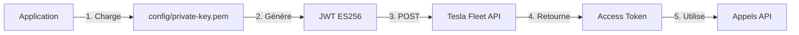

# 📁 Structure du Projet - Tesla Fleet API

## 🎯 Architecture sécurisée

```
tesla-app/
│
├── 📂 public/                          # ← DOCUMENT ROOT (seul dossier exposé au web)
│   ├── index.php                      # Interface web principale
│   ├── get-token.php                  # Endpoint API pour obtenir un token
│   └── .htaccess                      # Configuration Apache + sécurité
│
├── 📂 config/                          # ← Configuration sensible (HORS du public)
│   ├── private-key.pem                # Clé privée EC (secp256r1) - GARDER SECRET
│   └── public-key.pem                 # Clé publique (à uploader sur Tesla)
│
├── 📂 src/                             # ← Code métier
│   └── TeslaAuth.php                  # Classe d'authentification OAuth 2.0
│
├── 📂 vendor/                          # ← Dépendances Composer (généré)
│   ├── autoload.php
│   ├── firebase/php-jwt/              # Librairie JWT
│   ├── vlucas/phpdotenv/              # Gestion .env
│   └── ...
│
├── 📄 .env                             # ← Variables d'environnement (NON versionné)
├── 📄 .env.example                     # Template de configuration (versionné)
├── 📄 .gitignore                       # Protection Git
│
├── 📄 cli-get-token.php               # Script CLI pour tester l'auth
├── 📄 example-api-call.php            # Exemples d'appels API
├── 📄 setup.php                       # Script d'installation guidé
│
├── 📄 composer.json                    # Dépendances PHP
├── 📄 composer.lock                    # Versions verrouillées
├── 📄 Makefile                         # Commandes utiles
│
├── 📖 README.md                        # Documentation principale
├── 📖 QUICKSTART.md                    # Guide de démarrage rapide
├── 📖 MIGRATION.md                     # Guide de migration
├── 📖 SECURITY.md                      # Guide de sécurité
├── 📖 PROJECT_STRUCTURE.md             # Ce fichier
│
└── 📄 LICENSE                          # Licence du projet
```

## 🔒 Principes de sécurité

### ✅ Document Root = `public/` uniquement

Le serveur web doit pointer **UNIQUEMENT** vers `public/` :

```apache
# Apache
DocumentRoot /path/to/tesla-app/public

# Nginx
root /path/to/tesla-app/public;
```

### ✅ Fichiers sensibles hors du public

| Fichier           | Localisation | Exposé au web                  |
| ----------------- | ------------ | ------------------------------ |
| `private-key.pem` | `config/`    | ❌ NON (sécurisé)              |
| `public-key.pem`  | `config/`    | ❌ NON                         |
| `.env`            | racine       | ❌ NON (protégé par .htaccess) |
| `index.php`       | `public/`    | ✅ OUI (point d'entrée)        |
| `get-token.php`   | `public/`    | ✅ OUI (API endpoint)          |

### ✅ Protection .gitignore

Fichiers **jamais** versionnés :

- `.env`
- `*.pem`
- `*.key`
- `/config/*.pem`
- `/vendor/`

Fichiers versionnés :

- `.env.example` (template sans secrets)
- `.gitignore` (protection)
- Tout le code source

## 📦 Dépendances

### Composer (composer.json)

```json
{
  "require": {
    "vlucas/phpdotenv": "^5.6", // Gestion .env
    "firebase/php-jwt": "^6.11", // Génération JWT ES256
    "symfony/dotenv": "^7.3" // Alternative dotenv
  },
  "autoload": {
    "psr-4": {
      "TeslaApp\\": "src/" // Autoload namespace
    }
  }
}
```

### Extensions PHP requises

- ✅ `curl` - Requêtes HTTP
- ✅ `openssl` - Cryptographie EC
- ✅ `json` - Encodage/décodage
- ✅ `mbstring` - Manipulation strings

Vérifier :

```bash
php -m | grep -E 'curl|openssl|json|mbstring'
```

## 🔑 Fichiers de configuration

### .env (NON versionné)

```env
TESLA_CLIENT_ID=c9c40292-ddb3-4a87-9cc0-5a0193081024
TESLA_PRIVATE_KEY_PATH=config/private-key.pem
TESLA_FLEET_API_URL=https://fleet-api.prd.na.vn.cloud.tesla.com
TESLA_SCOPES=fleet_api:vehicles:read fleet_api:vehicles:write
```

### .env.example (versionné)

Template avec valeurs par défaut (sans secrets).

### .gitignore

```gitignore
# Environnement et secrets
.env
*.pem
*.key

# Dépendances
/vendor/

# Fichiers système
.DS_Store
*.log

# Configuration sensible
/config/private-key.pem
/config/*.pem
/config/*.key
```

## 📝 Scripts disponibles

### Scripts CLI

| Script                 | Usage                      | Description                   |
| ---------------------- | -------------------------- | ----------------------------- |
| `setup.php`            | `php setup.php`            | Configuration initiale guidée |
| `cli-get-token.php`    | `php cli-get-token.php`    | Obtenir un access token       |
| `example-api-call.php` | `php example-api-call.php` | Exemples d'appels API         |

### Scripts Web

| Script                 | URL              | Description                  |
| ---------------------- | ---------------- | ---------------------------- |
| `public/index.php`     | `/`              | Interface web principale     |
| `public/get-token.php` | `/get-token.php` | API endpoint (retourne JSON) |

### Makefile

```bash
make help           # Afficher toutes les commandes
make install        # Installer les dépendances
make setup          # Configuration initiale
make test           # Tester l'authentification
make test-api       # Tester les appels API
make generate-key   # Générer une paire de clés
make secure         # Vérifier les permissions
make dev            # Serveur de développement
make audit          # Audit de sécurité
```

## 🗂️ Organisation du code

### Namespace `TeslaApp\`

```
src/
└── TeslaAuth.php       → TeslaApp\TeslaAuth
```

Utilisation :

```php
use TeslaApp\TeslaAuth;

$auth = TeslaAuth::fromEnv();
$token = $auth->getAccessToken();
```

### Autoloading PSR-4

Configuré dans `composer.json` :

```json
"autoload": {
    "psr-4": {
        "TeslaApp\\": "src/"
    }
}
```

Regénérer :

```bash
composer dump-autoload
```

## 🔄 Flux d'authentification



### Étapes détaillées

1. **Chargement de la clé** : `TeslaAuth::loadPrivateKey()`

   - Lit `config/private-key.pem`
   - Vérifie l'existence et les permissions

2. **Génération du JWT** : `TeslaAuth::generateJWT()`

   - Payload : `iss`, `sub`, `aud`, `iat`, `exp`
   - Signature : ES256 (ECDSA + SHA-256)

3. **Requête OAuth** : `TeslaAuth::getAccessToken()`

   - Endpoint : `/oauth/token`
   - Grant type : `client_credentials`
   - Assertion : JWT signé

4. **Récupération du token**

   - Format : `{"access_token": "...", "token_type": "bearer", "expires_in": 28800}`

5. **Utilisation du token**
   - Header : `Authorization: Bearer {access_token}`

## 🛠️ Fichiers legacy (à migrer/supprimer)

Fichiers de l'ancienne structure :

- ❌ `jwt.php` - Remplacé par `cli-get-token.php`
- ❌ `callback_old.php` - À évaluer
- ❌ `private-key.pem` (racine) - À déplacer vers `config/`
- ❌ `public-key.pem` (racine) - À déplacer vers `config/`

### Migration

```bash
# Déplacer les clés
mv private-key.pem config/
mv public-key.pem config/

# Sécuriser
chmod 600 config/private-key.pem

# Supprimer l'ancien code (après vérification)
rm jwt.php callback_old.php
```

Voir [MIGRATION.md](MIGRATION.md) pour plus de détails.

## 📊 Tailles approximatives

| Dossier/Fichier | Taille | Description           |
| --------------- | ------ | --------------------- |
| `vendor/`       | ~5 MB  | Dépendances Composer  |
| `src/`          | ~5 KB  | Code métier           |
| `public/`       | ~10 KB | Interface web         |
| `config/`       | ~1 KB  | Clés cryptographiques |
| `.env`          | ~500 B | Configuration         |

Total : ~5 MB (principalement `vendor/`)

## 🔗 Ressources externes

### Documentation officielle

- [Tesla Fleet API](https://developer.tesla.com/docs/fleet-api)
- [OAuth 2.0 JWT Bearer](https://datatracker.ietf.org/doc/html/rfc7523)
- [ES256 (ECDSA)](https://datatracker.ietf.org/doc/html/rfc7518#section-3.4)

### Librairies utilisées

- [firebase/php-jwt](https://github.com/firebase/php-jwt)
- [vlucas/phpdotenv](https://github.com/vlucas/phpdotenv)

## 📋 Checklist de déploiement

### Développement

- [ ] ✅ Dépendances installées (`make install`)
- [ ] ✅ Configuration `.env` créée
- [ ] ✅ Clés générées (`make generate-key`)
- [ ] ✅ Test CLI réussi (`make test`)

### Production

- [ ] ✅ Document root = `public/`
- [ ] ✅ HTTPS activé
- [ ] ✅ Permissions 600 sur `config/private-key.pem`
- [ ] ✅ `display_errors = Off` dans `php.ini`
- [ ] ✅ `.env` protégé (pas dans `public/`)
- [ ] ✅ Backup de la clé privée (hors serveur)

Vérifier :

```bash
make audit
```

## 🎯 Prochaines étapes

1. **Lire la documentation** : [README.md](README.md)
2. **Démarrage rapide** : [QUICKSTART.md](QUICKSTART.md)
3. **Sécurité** : [SECURITY.md](SECURITY.md)
4. **Migration** : [MIGRATION.md](MIGRATION.md) (si ancienne version)

---

**📁 Structure optimale pour sécurité et maintenabilité.**
